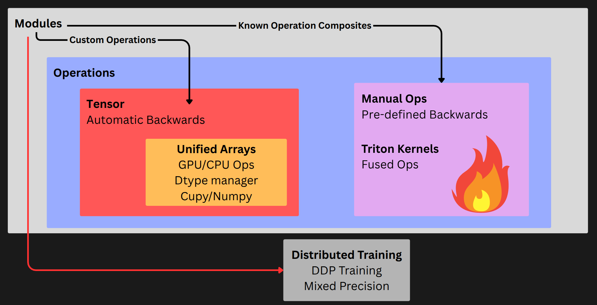

--------------------------------------------------------------------------------

The aim of MyTorch is to build a lightweight, readable and performant deep learning framework with the following features:

- **Automatic Differentiation** for the most commonly used operations
- **Manual Differentiation** support for known composites of operations to push performance
- **CPU & GPU** support leveraging [Cupy](https://github.com/cupy/cupy) and [Numpy](https://github.com/numpy/numpy)
- **Fused GPU Kernels** via [Triton](https://github.com/triton-lang/triton) to make GPUs go brrrrr
- **Distributed training** using Cupys NCCL Backend for multi-GPU setups
- **Mixed Precision Training** support in fp16 with dynamic gradient scaling for faster and memory efficient training
- **Education Focus**: Try to be as readable as possible to be hackable and transparent!
- **LLM Focused**: We will have some implementations of Convolutions, but they are notoriously challenging to reach CUDNN levels even with fused kernels, so these will be less of a focus for this repo!

### Try it in Colab!

[](https://colab.research.google.com/drive/1wOz7Q2QDVo0bvF-WtLTAEyg2WOBf14gu?usp=sharing) 

### References

There were a ton of really helpful resources that I used to make MyTorch! There are too many include all of them here, so I have placed links at the top of every file with the resources you should definitely explore! But the main inspirations were:

- Awesome implementation at [Autograd-from-Scratch](https://github.com/eduardoleao052/Autograd-from-scratch/tree/main) repository by [eduardoleao052](https://github.com/eduardoleao052)!
- [MicroGrad](https://github.com/karpathy/micrograd) is a great place to get started!'
- [nanoGPT](https://github.com/karpathy/nanoGPT/blob/master/train.py) is what much of the GPT2 scripts are based on!


### Installation

Installation is very easy!
```
git clone https://github.com/priyammaz/MyTorch.git
cd MyTorch
pip install .
```

If you want fused GPU operations for maximum performance, you can install the optional Triton support. Triton relies on a minimal PyTorch dependency to manage devices and drivers, but you won’t need PyTorch for typical use:

```
pip install .[triton]
```

## Usage

### MyTorch Structure

Using MyTorch will be nearly identical to PyTorch and Huggingface Accelerate! Here are some of the key features:




### Array Module

The ```mytorch.Tensor``` is a wrapper on our ```Array``` class. The ```Array``` is again just another wrapper that homogenizes ```Cupy``` and ```Numpy```. This allows us to use ```numpy``` method on tensors existing on the GPU, with the ```Array``` module automatically mapping to either Cupy or Numpy based on the device. 

All learnable parameters will be a ```Tensor``` as we need the methods to do autograd. But other things like our gradients, optimizer states, etc... will just be ```Arrays``` as we don't need that extra machinery.  

If you want to learn more about Numpy/Cupy array classes you can read about them [here](https://numpy.org/doc/stable/reference/arrays.classes.html)

```python
import mytorch
a = mytorch.randn(1,2)
print(a)
# Output:
# tensor([[-0.88644 -1.72318]], requires_grad=True)

print(a.data)
# Output:
# Array([[-0.88644 -1.72318]], dtype=float32)
```

<details>

<summary>Numpy Operations on GPU (Cupy) Arrays</summary>

This is a quick example showing how our ```Array``` module can pipe gpu or cpu tensors
through cupy or numpy respectively! The reason this works is because Cupy is nearly identical in usage to numpy so all of the method names are the same! You can explore this in the ```mytorch/_array.py```

```python
import mytorch
import numpy as np

# Create a random tensor on GPU
a = mytorch.randn(1,2, device="cuda")
print(a)
# Output
# tensor([[0.41041 0.60190]], device=cuda:0)

# The underlying .data is our `Array` Class
print(a.data)
# Output
# Array([[0.41041 0.60190]], dtype=float32, device='cuda:0')

# We can verify its type here that it is `Array`
print(type(a.data))
# Output
# <class 'mytorch._array.Array'>

# Each `Array` has an underlying ._array that is its numpy (if cpu) or cupy (if gpu)
print(type(a.data._array))
# Output
# <class 'cupy.ndarray'>

# We can use our np. methods even though it is a cupy (gpu) array underneath the hood!
print(np.pow(a.data, 2))
# Output
# Array([[0.16844 0.36228]], dtype=float32, device='cuda:0')
```
</details>


### Autograd

```py
a = mytorch.ones([1], requires_grad=True, device="cuda")
b = 2 * a
c = b**2
c.backward()

print("a.grad:", a.grad)
# Output:
# a.grad: Array([8.00000], dtype=float32, device='cuda:0')

print("b.grad:", b.grad)
# Output:
# b.grad: None
```
<details>

<summary>Keep Non-Leaf Node Grads</summary>

In the example above, ```b.grad``` was None as it isn't a leaf node, so 
we prune gradients automatically to conserve memory. If you need to see 
the grads for intermediate operations you can either tag the specific outputs 
you want with ```.retain_grad()```:


```py
import mytorch

a= mytorch.ones([1], requires_grad=True, device="cuda")
b = 2 * a
c = b**2
d = c*9

# Retain grad specifically for B
b.retain_grad()

d.backward(retain_graph=True)

print("a.grad:", a.grad)
# Output:
# a.grad: Array([8.00000], dtype=float32, device='cuda:0')

print("b.grad:", b.grad)
# Output:
# b.grad: Array([36.00000], dtype=float32, device='cuda:0')

print("c.grad:", c.grad)
# Output:
# b.grad: None

```

Or you can keep all of them by just specifing ```retain_graph=True``` in our ```.backward()```
```py
import mytorch

a= mytorch.ones([1], requires_grad=True, device="cuda")
b = 2 * a
c = b**2
d = c*9

d.backward(retain_graph=True)

print("a.grad:", a.grad)
# Output:
# a.grad: Array([8.00000], dtype=float32, device='cuda:0')

print("b.grad:", b.grad)
# Output:
# b.grad: Array([36.00000], dtype=float32, device='cuda:0')

print("c.grad:", c.grad)
# Output:
# b.grad: Array([9.00000], dtype=float32, device='cuda:0')

```

</details>

### Operations

Autograd only works through creating a composite of known functions. Here are the current list of methods we support or work on supporting. If you need other methods just submit a PR!

| **Binary Ops** | **Unary Ops** | **Reduction Ops** | **Indexing/Reshaping Ops** | **Other** |
|----------------|---------------|-------------------|----------------------------|-----------|
| Add | Exp | Sum | Indexing | Masked Fill|
| Sub | Log | Mean | Transpose |Sort |
| Mul | Abs | Var | Permute |Argsort|
| Div | Clamp | Max | Reshape | |
| Pow | Sqrt | Argmax | Flatten | |
| Matmul | Sin | Cumsum | Squeeze | |
| | Cos | | Unsqueeze | |
| | Tan | | Concat| |
| | Pow | | Stack| |
| | | | Chunk| |

### Tensor Factory

Creating tensors is also crucial, the following are available from the tensor factory:

| **Constant Initialization** | **Sequential/Special** | **Random Initialization** | **Like Operations** |
|------------------------------|------------------------|---------------------------|---------------------|
| zeros | arange | randn | zeros_like |
| ones | linspace | rand | ones_like |
| empty | eye | randint | empty_like |
| full | tril | | full_like |
| | | | randn_like |
| | | | rand_like |

### Modules

No Deep Learning Framework would be complete without a set of modules! These are a collection of the most important modules we would expect to have (and those we would like to add in the future!) Treat this as a roadmap of stuff that is to come!

| **Core Layers** | **Impl** | **Fused** | **Normalization** | **Impl** | **Fused** | **Activations** | **Impl** | **Fused** | 
|---------------|----------|-----------|---------------|----------|-----------|---------------|----------|-----------|
| Linear | ✅ | ✅ | LayerNorm | ✅ | ✅ | Sigmoid | ✅ | ❌ |
| Embedding | ✅ | ❌| BatchNorm1d | ✅ | ❌ | ReLU | ✅ | ❌ |
| Dropout | ✅ | ❌ | BatchNorm2d | ✅ | ❌ | GeLU | ✅ | ❌ | 
|  | | | GroupNorm | ❌ | ❌ | Softmax | ✅ | ✅ |
| | | | InstanceNorm | ❌ | ❌ | LeakyReLU | ❌ | ❌ |
| | | | RMSNorm | ❌ | ❌ | Tanh | ❌ | ❌ |

| **Losses** | **Impl** | **Fused** | **Attention** | **Impl** | **Fused** |
|---------------|----------|-----------|---------------|----------|-----------|
| CrossEntropyLoss | ✅ | ✅ | ScaledDotProduct | ✅ | ✅ |
| MSELoss | ✅ | ❌ | SlidingWindowAttention | ❌ | ❌ |
| BCELoss | ❌ | ❌ | | | |
| BCEWithLogitsLoss | ❌ | ❌ | | | |
| L1Loss | ❌ | ❌ | | | |
| SmoothL1Loss | ❌ | ❌ | | | |
| NLLLoss | ❌ | ❌ | | | |
| KLDivLoss | ❌ | ❌ | | | |
| HuberLoss | ❌ | ❌ | | | |
| CosineEmbeddingLoss | ❌ | ❌ | | | |

### Convolutions/Pooling

The focus for MyTorch is for LLM training, but Convolutions are also important! Unfortunately, it is very challenging to get CUDNN level performance (even with triton kernels) for convolutions. So these will be more of a learning exercise than for actual use! We could leverage the [Cudnn Frontend](https://github.com/NVIDIA/cudnn-frontend) but I want the dependencies to be as minimal as possible, and the goal here is to learn!

| **Operation**         | **Impl** | **Fused** |
|-----------------------|----------|-----------|
| **Core Layers**       |          |           |
| Conv1d                | ✅       | ✅        |
| Conv2d                | ✅       | ✅        |
| ConvTranspose1d       | ✅       | 🚫        |
| ConvTranspose2d       | ✅       | 🚫        |
| MaxPool2d             | ✅       | 🚫        |
| AvgPool2d             | ✅       | 🚫        |
| MaxPool1d             | ❌       | 🚫        |
| AvgPool1d             | ❌       | 🚫        |
| AdaptiveAvgPool2d     | ✅       | 🚫        |


### How to Use
These operations can be accessed much like in PyTorch:

```python
import mytorch.nn as nn

linear = nn.Linear(2,2)
print(linear)
# Output:
# Linear(in_features=2, out_features=2, bias=True)

print(linear.weight)
# Output
# tensor([[ 0.00530  0.30852]
#         [-0.16999  0.65585]], requires_grad=True)

print(linear.bias)
# Output
# tensor([0.59509 0.53882], requires_grad=True)

```

### Fused Operations

Optionally we will work on providing fused ```Triton``` kernels to accelerate training!

Fused operations will be accessible by adding in:

```python
import mytorch.nn as nn

# Not Fused
ln = nn.Layernorm(256)

# Fused
ln_fused = nn.LayerNorm(256, fused=True)
```
### Structuring a Model 

Building a model is identical to PyTorch. 

```python
class MyTorchMNIST(nn.Module):

    def __init__(self):
        super().__init__()

        self.fc1 = nn.Linear(784, 256)
        self.drop1 = nn.Dropout(0.1)
        self.fc2 = nn.Linear(512, 10)
        self.activation = nn.ReLU()

    def forward(self, x):
        x = self.drop1(self.activation(self.fc1(x)))
        x = self.fc2(x)
        return x

model = MyTorchMNIST()
print(model)
# Output
# MyTorchMNIST(
#   (fc1): Linear(in_features=784, out_features=256, bias=True)
#   (drop1): Dropout(p=0.1)
#   (fc2): Linear(in_features=512, out_features=10, bias=True)
#   (activation): ReLU()
# )

```

### Optimizers

| **Optimizer** | **Impl** |
|---------------|----------|
| SGD | ✅ |
| Adam | ✅ |
| AdamW | ✅ |
| RMSprop | ❌ |
| Adagrad | ❌ |
| Adadelta | ❌ |


To access optimizers you can simply do:

```python
from mytorch.optim import AdamW

# .. model definition above
model = MyModel()
optimizer = AdamW(model.parameters(), lr=0.001)
```

## DataLoader 

Efficiently loading data is another part of training! You can do this by leveraging our MyTorch Dataloader!

```python
from mytorch.utils.data import Dataset, DataLoader

dataset = # Define your dataset as you normally do in PyTorch
loader = DataLoader(dataset, num_workers=8)

### Optionall you can provide a collate_fn
def collate_fn(batch):
    ### ... do collation
    return collated_data

loader = DataLoader(dataset, num_workers=8, collate_fn=collate_fn)

```

## Accelerator

To enable ```mixed-precision``` training and ```DDP```, you can leverage the Accelerator Class. This is to build something close to the [Huggingface Accelerator](https://huggingface.co/docs/accelerate/en/index)

### Configure the Accelerator

You need to setup the distributed environment for your specific system! If you pip installed ```MyTorch``` then you will be able to run this! If instead you pulled the git repo, you have a few other options.

Run the following and answer the questions!
```bash
mytorchrun config
```

### Verify Environment 

To make sure your environment is properly configured you can run the following and check for errors

```
mytorchrun test
```

### Use the Accelerator 

In your training code you can just use the accelerator as follows:

```python
# training_script.py

from mytorch.accelerate import Accelerator

accelerator = Accelerator(gradient_accumulation_steps=gradient_accumulation_steps,
                          mixed_precision=mixed_precision,
                          log_wandb=log_wandb)

model = SomeModel()
optimizer = AdamW(model.parameters(), lr=0.001)
loader = DataLoader(dataset)

### Prepare for Training ###
model, optimizer, loader = accelerator.prepare(model, optimizer, loader)

completed_steps = 0
for batch in loader:

    loss = model(batch)

    ### Auto accumulated grads if grad_accum_steps > 1
    accelerator.backward(loss)

    # Clip gradients (and get the grads to check on training health)
    grad_norm = accelerator.clip_grad_norm_(args.max_grad_norm)

    ### Only actually runs after a full accumulation is complete, otherwise no-ops
    optimizer.step()
    optimizer.zero_grad()

    ### Accelerator tracks when accumulation is done, the flag is just sync_grad ###
    if accelerator.sync_grad:

        completed_steps += 1
        
        ### Returns the average loss across ALL GPUS if in distributed mode otherwise no-op
        loss = accelerator.gather_for_metrics(loss)

        ### Will only print on main device (GPU Rank 0)
        accelerator.print(log_statement)

        ### Log with Wandb if enabled ###
        logging_dict = {"loss": loss}
        accelerator.log(logging_dict, step=completed_steps)

```

### Checkpointing 

A common operation we need is to checkpoint our model as it goes! This is made very simple with:

```python
accelerator.save_state(os.path.join(path_to_experiment, f"checkpoint_{completed_steps}"))
```

This will store a ```model.safetensors```, ```optimizer.bin``` and optionally an ```mp_config.bin``` if training in mixed precision mode.

To resume training you can just do 

```python
accelerator.load_state(<PATH_TO_CHECKPOINT_DIR>)
```

### Launch Training for DDP

To actually run this training script in DDP mode you need to do:

```bash
mytorchrun launch training_script.py
```

<details>
<summary>What if you are using MyTorch Git Repo?</summary>

If you are just cloned the git repo you have two options!

#### Install From Source

```python
pip install .
```

#### Use Full Path To DDP Launcher

```
python -m mytorch.distributed.launch --num_gpus 2--master_addr 127.0.0.1 --master_port 13333 training_script.py
```

</details>
<br>


## Train GPT2:

Although this repo is educational, it also can be used for some serious training tasks! My GPT2 Implementation here is intended to be closely matched to [NanoGPT](https://github.com/karpathy/nanoGPT)

### Train Tiny Shakespeare (10M Parameters)

First we have to prepare the data

```bash
python prepare_data/prepare_shakespeare.py --path_to_save "data/shakespeare"
```

And from there you can launch your training!
```
bash train_gpt2.sh shakespeare 
```

Optionally you can add the following tags:

```
bash train_gpt2.sh shakespeare  --mixed_precision --fused --num_gpus 2 --log_wandb
```

This should only take a few minutes and create a final checkpoint in ```work_dir/gpt2-small-shakespeare```

<details>
<summary>Using MyTorch Launcher</summary>

You will see ```train_gpt2.sh``` uses ```mytorch.distributed.launch```. But if you setup
the ```mytorchrun config``` then you can equivalently use the following launch code:

```bash
mytorchrun launch train_gpt2.py \
    --project_name gpt2-small-shakespeare \
    --working_directory work_dir \
    --context_length 256 \
    --model_size small \
    --dropout_p 0.0 \
    --path_to_data data/shakespeare \
    --train_iterations 2500 \
    --eval_interval 1000 \
    --eval_iterations 200 \
    --batch_size 32 \
    --gradient_accumulation_steps 1 \
    --max_lr 1e-3 \
    --min_lr 1e-4 \
    --warmup_steps 500 \
    --weight_decay 0.1 \
    --max_grad_norm 1.0 \
    --beta1 0.9 \
    --beta2 0.95 \
    --log_iter 25 \
    --fused \
    --mixed_precision \
    --log_wandb
```

</details>

### Inference Tiny Shakespeare

We can also go ahead and inference this model with:

```
python inference_gpt2.py work_dir/gpt2-small-shakespeare/ --device cuda
```

Optionally you can add the following options:

```
python inference_gpt2.py work_dir/gpt2-small-shakespeare/ --device cuda --temperature 0.8 --topk 15
```


Sample Output:

```
KING RICHARD III:
Alas! how my children!
Whom I descend is hardly and for words?
How far breath, he might have lost it call'd
Our late's morning: if all confess excellens,
Or in a safe brave falsehood, he's gone, to signify
You take induce conferemonities.

Think Waewarwick was with find fellow youse.

WARWICK:
Why then, the king is dead; whom we will obey.

Messenger:
My Lord of Norfolk, he urged in his soldier,
He troubled with all frost.

HENRY BOLINGBROKE:
Welcome, my lord.
```

### Train OpenWebText (124M Parameters)

Training a tiny GPT model isn't too much of a problem. What about training a GPT2-Base model?

### Prepare OpenWebText Dataset

```bash
# HF_HOME="<CACHE_DIR>" optionally set if you want to change default HF Cache directory
python prepare_data/prepare_owt.py --num_proc 8 --path_to_save data/openwebtext
```

### Train on OpenWebText

```python
bash train_gpt2.sh owt --mixed_precision --fused --num_gpus 4 --log_wandb
```

My experiment was on a 4xGH100 Node training for about 4 days, reaching a roughly 2.95 loss  in about 250K steps! This is pretty close to my reference implementation from [NanoGPT](https://github.com/karpathy/nanoGPT)!


### How does AutoGrad work?

### Computational Graph

The most important part of the AutoGrad system is building the computational graph to know the order of backpropagation. 

#### Example 1: Gradient Propagation 


Like in every neural network, we are propagating gradients from the end of the network back to the beginning.

The last operation we do is Multiplication and we need to propagate the gradients to the inputs of that operation. There are two paths here, going up the blue path and down the yellow path. Lets just say the top paths appears first in the recursion, it doesn't really matter you could also do bottom path first!

The gradients for the top path then propagate back again to the top Plus node, and again we propagate the gradient to the top-left most node (at the end of the blue path). Now that we are at the deepest part of the graph, we can then go back up a step again and complete the purple path. 
 
We then go all the way back up again and then go down the yellow path, again going all the way down always taking the top path, and then working our way back up completing the green path. By doing this we will recursively iterate through the entire graph!

This should remind you very closely of Depth-First Search 

### Example 2: Barriers to Gradient Propagation


Depth first search is not exactly correct though. Lets look at this example! Just like before we start at the end and work our way back. We will first propagate our gradient down the blue path just like before. Then we will once we get to the end of the blue path, we can move up a node and then update the light-blue node using the orange path. Now if we kept Depth First search going, we would continue propagating our gradients from the light-blue node **BUT THIS IS WRONG**. The light blue node has a dependencies from two separate branches. 

This is why we track our children of every node. Until a node has exhasted all its children (i.e. all the paths have come to it) we cannot continue onwards. The light-blue node in this case has 2 children. Doing the top path will exhaust one of them, but we must complete the second path as well to exhast the second child. Therefore we gate our Depth First Search so we dont continue to propagate past a node that hasn't been fully exhasted!

So now, we use the orange path to give our first gradient injection into the light-blue node and then work our way back up and then continue down the yellow path. Once the yellow path ends on the light-blue node, we can then propagate the gradient back again via the purple path and then green path for the final nodes. 

### Blending AutoGrad and Manual Grad

Technically we can do everything with Autograd. If you want, many of the layers have both a manual and auto mode so you can test it. But, that isn't always efficient. For example, we can do automatic differentiation of the Sigmoid function and it will work fine. But we know the derivative of sigmoid, so for many of the known composite of ops I have added in the manual backward pass as its just more memory efficient and it keeps us from having to store more intemediate states. 

```python
def sigmoid(x, auto=False):

    if auto:
        return 1 / (1 + (-x).exp())
    else:
        x_cp = x.data
        out_data = 1 / (1 + np.exp(-x_cp))

        def _sigmoid_backward(grad_output):
            grad_input = grad_output * out.data * (1 - out.data)
            if x.grad is None:
                x.grad = grad_input
            else:
                x.grad += grad_input
        
        requires_grad = x.requires_grad and Tensor.build_graph_enabled()
        out = Tensor(
            out_data, 
            requires_grad=requires_grad,
            grad_fn=_sigmoid_backward if requires_grad else None, 
            grad_fn_name="<SigmoidBackward>" if requires_grad else None
        )

        if requires_grad:
            out._add_parents(x)

        return out
```

### Fused Operations

Many of our operations are just multiple ops happening back to back. In Softmax for example, on a specific vector of logits we do:

1) Find max of vector
2) Subtract max from vector
3) exp every element in vector
4) add together our exponentiated vector
5) divide every element by this sum

Each of these operations will be an individual kernel launch on our GPU. The issue is that, GPUs may be fast, but moving data around on the GPU is typically the bottleneck for many of these operations. 

Fused operations follow a simple idea, why not copy all the data once, do all the work there, and then copy back? And that is exactly what we do! Traditionally this meant writing Cuda Kernels, but you can get high performance GPU kernels pretty easily with [Triton](https://triton-lang.org/main/index.html)

Triton is not too challenging to learn, it just needs some practice! I think my fused softmax at [```mytorch/nn/fused_ops/softmax.py```](mytorch/nn/fused_ops/softmax.py) is a great place to start, as you will see the differences immediately!

### Plans for this Repo

I am not even close to done! Here are some of the stuff I want to work on next to keep this going (on top of finishing all the unfinished ops from above)!

- [ ] Make a Tiny GPT2 Example for Colab
- [ ] Fused Linear Layer w/ Grouped MatMul and Bias
- [ ] Fused Embedding Layer
- [ ] Flash Attention
  - [ ] Add Dropout
  - [ ] Add Cross Attention
  - [ ] Add custom attention masks
  - [ ] Add Sliding Window Attention
  - [ ] Add Grouped Query Attention
- [ ] KV Cache for Inference
  - [ ] Fused Kernel for KV Caching
- [ ] Reimplement and Reproduce Llama
  - [ ] Rotary Embeddings
- [ ] Mixture of Experts
- [x] Benchmark Scripts to scope gains from Fused Ops
- [ ] Use Fused Conv2d/Conv1d for AvgPool Op
- [ ] Once I have a stable version get this in PyPi