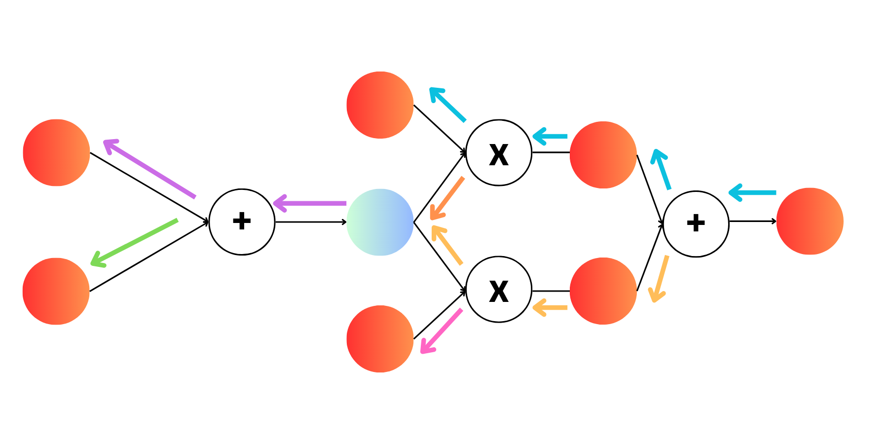

## The Goal

Build a relatively robust Deep Learning Framework that has the following feautures:

- Automatic Differentiation for most common set of ops
- Manual Differentiation for known groupings of ops
- CPU/GPU support
- Fused Kernels w/ Triton to make GPUs go brrrrr
- Distributed training using Cupys NCCL Backend
- Mixed Precision Training support with Dynamic Grad Scaling
- Make it as educational as possible!

<details>
<summary><b><span style="font-size: 2em;">Installation</span></b></summary>

### Basic Setup 

We need to install cupy, conda makes this the easiest!
```
conda install -c conda-forge cupy cudnn cutensor nccl
```

Just need a few other packages for our training scripts!
```
pip install requests "datasets<4.0.0" wandb requests tqdm tiktoken safetensors
```

With this you are ready for training, with support for mixed precision and distributed training!

<details>
<summary><b><span style="font-size: 2em;">Advanced Setup for Fused Operations</span></b></summary>

To access fused operations we need to install [Triton](https://github.com/triton-lang/triton) which defines all of our kernels! The main issue you will face is that Triton has a torch dependency, and torch comes with its own version of cuda. We need to ensure our cuda versions all match up so they don't conflict!

<details>
<summary><b><span style="font-size: 1.3em;">Step 1: Check Your Max Supported Cuda Version</span></b></summary>

Run the following
```
nvidia-smi
```

You will see something like:

```bash
+-----------------------------------------------------------------------------------------+
| NVIDIA-SMI 570.86.10              Driver Version: 570.86.10      CUDA Version: 12.8     |
|-----------------------------------------+------------------------+----------------------+
| GPU  Name                 Persistence-M | Bus-Id          Disp.A | Volatile Uncorr. ECC |
| Fan  Temp   Perf          Pwr:Usage/Cap |           Memory-Usage | GPU-Util  Compute M. |
|                                         |                        |               MIG M. |
|=========================================+========================+======================|
|   0  NVIDIA RTX A6000               Off |   00000000:41:00.0 Off |                  Off |
| 30%   46C    P8              7W /  300W |      19MiB /  49140MiB |      0%      Default |
|                                         |                        |                  N/A |
+-----------------------------------------+------------------------+----------------------+

```

In my case you see a ```CUDA Version 12.8```. Now this doesn't necessarily mean that Cupy and PyTorch will use Cuda Version 12.8, just that it is the max supported version for the installed driver! But keep this in mind as when we do install any version greater than this Cuda version!
</details>

<details>
<summary><b><span style="font-size: 1.3em;">Step 2: Check Prebuilt PyTorch Installs</span></b></summary>
We need to ensure that everything we install matches the PyTorch version we will also install. You can take a look at their installation page to see supported. Pick whatever Cuda version you want to install! As long as its <= to your ```nvidia-smi``` version from earlier it should work. 

</details>
<details>
<summary><b><span style="font-size: 1.3em;">Step 3: Check your NVCC Version</span></b></summary>

Run the following
```
nvcc --version
```

You should see something like

```bash
nvcc: NVIDIA (R) Cuda compiler driver
Copyright (c) 2005-2025 NVIDIA Corporation
Built on Wed_Jan_15_19:20:09_PST_2025
Cuda compilation tools, release 12.8, V12.8.61
Build cuda_12.8.r12.8/compiler.35404655_0
```

In my case you see a that my NVCC Version is also 12.8 so it matches my Cuda version from ```nvidia-smi``` and I am using the latest version my drivers support! Yours could be less, your ```nvidia-smi``` version could be 12.6, but ```nvcc``` is using 12.4. This is totally fine, the version we want to use is our NVCC version for all of our installs going forward

### Problems
### Problem #1: What if NVCC Doesn't exist?

It is possible that ```NVCC``` doesn't exist on your computer. If you didn't install the cuda-toolkit then you wouldn't have it.


### Problem #2: What if my NVCC Cuda Version Doesn't Match the Cuda Version I Want from PyTorch?

This is the more likely issue, that your system may be using a specific cuda version that PyTorch doesn't have a prebuilt wheel for. For example, if your NVCC is version 12.3, but PyTorch doensn't have a specific install for this. PyTorch doesn't really care about your systenms cuda version anyway as it installs its own binaries within the environment. But Cupy does use your NVCC version and a mismatch here would cause issues down the line if we don't have everything be the same!

## Solution (You should do this anyway)

### Easy

As long as we are using Cuda versions starting at 12 (sorry 11.8 folks) then you get an easy fix
```
conda install -c conda-forge cuda-nvcc cuda-version=<DESIRED_VERSION>
```

This will install a local version of NVCC into your Conda environment and you will be good to go! Just make your Desired Version to be whatever Cuda version you wanted from PyTorch. 


### Hard(ish)

If you can't do this, then you need to make a system level update and change your Cuda Version following Nvidias documentations on the [Cuda Toolkit](https://developer.nvidia.com/cuda-toolkit)

</details>

<details>
<summary><b><span style="font-size: 1.3em;">Step 4: Install Cupy and PyTorch</span></b></summary>

#### Install Cupy With Your Selected Cuda Version

```
conda install -c conda-forge cupy cudnn cutensor nccl cuda-version=<DESIRED_VERSION>
```

#### Install PyTorch With Your Selected Cuda Version 

This is an example, go to PyTorch to find your specific version [here](https://pytorch.org/get-started/locally/) or if you need an older cuda variant you can search [here](https://pytorch.org/get-started/previous-versions/)

```
pip install torch==2.7.1 --index-url https://download.pytorch.org/whl/cu128
```

You can opt not to install ```torchvision``` or ```torchaudio```. I do have a few examples using the MNIST dataset from ```torchvision``` so you can install it if you want!

### Install Everything Else Like Before

```
pip install requests "datasets<4.0.0" wandb requests tqdm tiktoken safetensors
```

### Verify Triton Install

Some PyTorch versions ship with ```Triton```, but some dont. Just incase you can install it with:

```
pip install triton
```
</details>

</details>

</details>


### Code Inspiration!
- Awesome implementation at [Autograd-from-Scratch](https://github.com/eduardoleao052/Autograd-from-scratch/tree/main) repository by [eduardoleao052](https://github.com/eduardoleao052)!
- [MicroGrad](https://github.com/karpathy/micrograd) is a great place to get started!'
- [nanoGPT](https://github.com/karpathy/nanoGPT/blob/master/train.py) is what much of the GPT2 scripts are based on!

### Why Do We Care about AutoGrad?

Autograd gives us the flexibility to compose any arbritary function, and given that each operation is defined with its derivative, we can perform automatic differentiation through the system!

Typical computations are:
- adding
- subtracting
- multiplying
- dividing
- matrix multiplication
- exponentiating
- log
- averaging

With these limited computations, we can represent a large class of functions! Take Sigmoid again for example:

$$ sigmoid(x) = \frac{1}{1 + \exp(-x)} $$

But really, this is just a combination of exponentiation, sum and division! So as long as we know the derivative of the three sub-operations in sigmoid, we can use chain rule to get the overall derivative of the entire function! Lets write the composition of functions here:

$$a(x) = e^{-x}$$

$$b(x) = 1 + a(x)$$

$$\sigma(x) = \frac{1}{b(x)}$$

If you take the chain rule derivative of $\frac{d \sigma(x)}{d x}$ you will end up with the same formula as normal for the derivative of the Sigmoid function. 

### Computational Graph

The most important part of the AutoGrad system is building the computational graph to know the order of backpropagation. 

#### Example 1: Gradient Propagation 


Like in every neural network, we are propagating gradients from the end of the network back to the beginning.

The last operation we do is Multiplication and we need to propagate the gradients to the inputs of that operation. There are two paths here, going up the blue path and down the yellow path. Lets just say the top paths appears first in the recursion, it doesn't really matter you could also do bottom path first!

The gradients for the top path then propagate back again to the top Plus node, and again we propagate the gradient to the top-left most node (at the end of the blue path). Now that we are at the deepest part of the graph, we can then go back up a step again and complete the purple path. 
 
We then go all the way back up again and then go down the yellow path, again going all the way down always taking the top path, and then working our way back up completing the green path. By doing this we will recursively iterate through the entire graph!

This should remind you very closely of Depth-First Search 


### Example 2: Barriers to Gradient Propagation


Depth first search is not exactly correct though. Lets look at this example! Just like before we start at the end and work our way back. We will first propagate our gradient down the blue path just like before. Then we will once we get to the end of the blue path, we can move up a node and then update the light-blue node using the orange path. Now if we kept Depth First search going, we would continue propagating our gradients from the light-blue node **BUT THIS IS WRONG**. The light blue node has a dependencies from two separate branches. 

This is why we track our children of every node. Until a node has exhasted all its children (i.e. all the paths have come to it) we cannot continue onwards. The light-blue node in this case has 2 children. Doing the top path will exhaust one of them, but we must complete the second path as well to exhast the second child. Therefore we gate our Depth First Search so we dont continue to propagate past a node that hasn't been fully exhasted!

So now, we use the orange path to give our first gradient injection into the light-blue node and then work our way back up and then continue down the yellow path. Once the yellow path ends on the light-blue node, we can then propagate the gradient back again via the purple path and then green path for the final nodes. 


### Blending AutoGrad and Manual Grad

Technically we can do everything with Autograd. If you want, many of the layers have both a manual and auto mode so you can test it. But, that isn't always efficient. For example, we can do automatic differentiation of the Softmax function and it will work fine. But we know the derivative of softmax, so for many of the known ops I have added in the manual backward pass as its just more memory efficient and it keeps us from having to store more intemediate states. 

```python
def relu(x, auto=False):
    if auto: # Use Autograd
        mask = Tensor(cp.where(x.data < 0, 0, 1).astype(cp.float32))
        return x * mask

    else: # Use manually defined backward pass
        out_data = cp.maximum(x.data, 0, out=cp.empty_like(x.data))

        def _relu_backward(input_grad):
            if x.requires_grad:
                grad_input = input_grad * (x.data > 0)
                if x.grad is None:
                    x.grad = cp.zeros_like(x.data, dtype=cp.float32)
                x.grad += grad_input

        requires_grad = x.requires_grad and Tensor.build_graph_enabled()
        out = Tensor(
            out_data,
            requires_grad=requires_grad,
            grad_fn=_relu_backward if requires_grad else None,
            grad_fn_name="<ReLUBackward>" if requires_grad else None
        )

        if requires_grad:
            out._add_parents(x)

        return out
```


## Features

### MyTorch is a Fully Autograd Based System

I have implemented the most important operations, although theres always more! But you can use it like this:

```python
from mytorch import Tensor
import cupy as cp 

a = Tensor([1], requires_grad=True)
b = a + 2
c = b**2

print(c)
# Output:
[9.], grad_fn=<PowBackward>, device=cuda:0

c.backward()
print(a.grad)
# Output:
[6.]

```

### MyTorch Basic Usage

Just as a very simply explanation of the code, the heart of the AutoGrad system is found in the ```Tensor``` class found in ```mytorch.tensor```. These tensors have all of the operations defined above along with their derivatives and ability to store the computational graph! The entire Tensor class is just a wrapper on top of standard cupy operations, we just manually track the gradients for backpropagation!

```python
import cupy as cp
import mytorch

tensor = mytorch.Tensor(cp.array([1,2,3]), requires_grad=True)
```

The use of this should be pretty similar to vanilla PyTorch to make it as familiar as possible! A note, this examples requires the installation of ```torchvision``` but its easy enough to write a dataloader on this dataset that doesn't require any torch!

```python
import argparse
import cupy as cp
import numpy as np
from tqdm import tqdm
import mytorch 
import mytorch.nn as nn
import mytorch.optim as optim
from mytorch.utils.data import DataLoader

# Use PyTorch MNIST Class for Simplicity ###
from torchvision.datasets import MNIST

def main(args):

    ### Prep Model ###
    class MyTorchMNIST(nn.Module):

        def __init__(self):
            super().__init__()

            self.fc1 = nn.Linear(784, 512)
            self.drop1 = nn.Dropout(0.1)
            self.fc2 = nn.Linear(512, 256)
            self.drop2 = nn.Dropout(0.1)
            self.fc3 = nn.Linear(256, 128)
            self.drop3 = nn.Dropout(0.1)
            self.fc4 = nn.Linear(128, 10)

            self.activation = nn.ReLU()

        def forward(self, x):

            x = self.drop1(self.activation(self.fc1(x)))
            x = self.drop2(self.activation(self.fc2(x)))
            x = self.drop3(self.activation(self.fc3(x)))
            x = self.fc4(x)

            return x
        
    model = MyTorchMNIST()
    model = model.to("cuda")

    ### Prep Dataset ###
    train = MNIST("../../data", train=True, download=True)
    test = MNIST("../../data", train=False, download=True)

    def collate_fn(batch):

        ### Prep and Scale Images ###
        images = cp.stack([cp.array(i[0]).reshape(28*28)for i in batch]) / 255

        ### One Hot Encode Label (MNIST only has 10 classes) ###
        labels = [i[1] for i in batch]

        images = mytorch.Tensor(images).astype(cp.float32)
        labels = mytorch.Tensor(labels)

        return images, labels

    trainloader = DataLoader(train, batch_size=args.batch_size, collate_fn=collate_fn, num_workers=2)
    testloader = DataLoader(test, batch_size=args.batch_size, collate_fn=collate_fn, num_workers=2)

    ### Prep Optimizer ###
    optimizer = optim.Adam(model.parameters(), lr=args.lr)

    ### Prep Loss Function ###
    loss_fn = nn.CrossEntropyLoss()

    ### Train Model for 10 Epochs ###
    for epoch in range(args.epochs):

        print(f"Training Epoch {epoch}")

        train_loss, train_acc = [], []
        eval_loss, eval_acc = [], []

        model.train()
        for images, labels in tqdm(trainloader):
            
            ### Set on correct device ###
            images, labels = images.to("cuda"), labels.to("cuda")

            ### Pass Through Model ###
            pred = model(images)
            
            ### Compute Loss ###
            loss = loss_fn(pred, labels)

            ### Compute Accuracy ###
            predicted = pred.argmax(dim=-1)
            accuracy = (predicted == labels).sum() / len(predicted)

            ### Log Results ###
            train_loss.append(loss.item())
            train_acc.append(accuracy.item())
            
            ### Update Model ###
            loss.backward()
            optimizer.step()
            optimizer.zero_grad()


        model.eval()
        for images, labels in tqdm(testloader):
            
            ### Set on correct device ###
            images, labels = images.to("cuda"), labels.to("cuda")

            with mytorch.no_grad():
                ### Pass Through Model ###
                pred = model(images)
                
            ### Compute Loss ###
            loss = loss_fn(pred, labels)

            ### Compute Accuracy ###
            predicted = pred.argmax(dim=-1)
            accuracy = (predicted == labels).sum() / len(predicted)

            eval_loss.append(loss.item())
            eval_acc.append(accuracy.item())

        print(f"Training Loss: {np.mean(train_loss)}")
        print(f"Eval Loss: {np.mean(eval_loss)}")
        print(f"Training Acc: {np.mean(train_acc)}")
        print(f"Eval Acc: {np.mean(eval_acc)}")

    
```

### Convolutions

An important architecture for lots of architectures is the convolution! Although we can't reach max throughput on convolution ops like custom cuda kernels can, we can get close using the Im2Col/Col2Im algorithm! They work the same way as pytorch!

```python
class ConvNet(nn.Module):

    def __init__(self):
        super().__init__()

        self.conv1 = nn.Conv2d(in_channels=3, 
                               out_channels=32, 
                               kernel_size=3,
                               stride=2, 
                               padding=1)

        self.bn1 = nn.BatchNorm2d(32)
        self.drop1 = nn.Dropout(0.1)

        self.conv1 = nn.Conv2d(in_channels=3, 
                               out_channels=32, 
                               kernel_size=3,
                               stride=2, 
                               padding=1)
                               
        self.bn1 = nn.BatchNorm2d(32)
        self.drop1 = nn.Dropout(0.1)

        self.conv2 = nn.Conv2d(in_channels=3, 
                               out_channels=32, 
                               kernel_size=3,
                               stride=2, 
                               padding=1)
                               
        self.bn2 = nn.BatchNorm2d(32)
        self.drop2 = nn.Dropout(0.1)
        
        ...

    def forward(self, x):
        
        # Standard Forward Definition 
        ...


```

### Transformers

Well we have linear layers, we may as well build a transformer! And that works out too! For example here is the attention mechanism, but you can find mroe in ```models/gpt2.py```

```python
class Attention(nn.Module):

    def __init__(self, embed_dim, num_heads, attn_dropout_p=0.1):
        super().__init__()
        ### Sanity Checks ###
        assert embed_dim % num_heads == 0, "Double check embedding dim divisible by number of heads"

        ### Attention Head Dim ###
        self.embed_dim = embed_dim
        self.num_heads = num_heads
        self.head_dim = embed_dim // num_heads

        ### Attention Projections ###
        self.q_proj = nn.Linear(embed_dim, embed_dim)
        self.k_proj = nn.Linear(embed_dim, embed_dim)
        self.v_proj = nn.Linear(embed_dim, embed_dim)
        self.softmax = nn.Softmax()
        self.attn_drop = nn.Dropout(dropout_p=attn_dropout_p)

        ### Post Attention Projection ###
        self.out_proj = nn.Linear(embed_dim, embed_dim)
        self.proj_drop = nn.Dropout(dropout_p=attn_dropout_p)
        

    def forward(self, x, attention_mask=None):
     
        ### Store Shape ###
        batch, seq_len, embed_dim = x.shape

        ### Flatten Batch and Seq Len Dimension ###
        x = x.reshape(batch*seq_len, embed_dim)
   
        ### Compute Attention with Flash Attention ###
        q = self.q_proj(x).reshape(batch, seq_len, self.num_heads, self.head_dim).transpose(1,2)
        k = self.k_proj(x).reshape(batch, seq_len, self.num_heads, self.head_dim).transpose(1,2)
        v = self.v_proj(x).reshape(batch, seq_len, self.num_heads, self.head_dim).transpose(1,2)
       
        ### Compute Attention (Attention Mask has shape Batch x Sequence len x Sequence len) ###
        scores = (q @ k.transpose(-2, -1)) / self.head_dim**0.5
    
        ### Add attention mask if it exists ###
        if attention_mask is not None:
            scores += attention_mask
     
        attention = self.softmax(scores, dim=-1)
        attention = self.attn_drop(attention)

        output = attention @ v
        output = output.transpose(1,2).reshape(batch*seq_len, embed_dim)
        
        ### Compute Output Projection (on flattened dimension) ###
        output = self.out_proj(output)
        output = self.proj_drop(output)

        output = output.reshape(batch, seq_len, embed_dim)
        
        return output
```

### Distributed Training

If you got multiple GPUs why not use them? Here is a wrapper like [Huggingface Accelerate](https://huggingface.co/docs/accelerate/en/index) to allow you to train on multiple GPUs (given you are on the same node!). This is possible due to CuPy and its support for NCCL!

```python
... 
from miniddp.accelerate import Accelerator
accelerator = Accelerator()

class MyTorchMNIST(nn.Module):
    def __init__(self):
        super().__init__()
        
        self.fc1 = nn.Linear(784, 512)
        self.drop1 = nn.Dropout(0.1)
        self.fc2 = nn.Linear(512, 10)
        self.activation = nn.ReLU()

    def forward(self, x):
        x = self.drop1(self.activation(self.fc1(x)))
        x = self.drop2(self.activation(self.fc2(x)))
        x = self.fc4(x)
        return x

model = MyTorchMNIST()
accelerator.print(model) # Only prints on main rank

train = MNIST("../../data", train=True, download=False)

def collate_fn(batch):
    images = np.concatenate([np.array(i[0]).astype(np.float32).reshape(1,784) for i in batch]) / 255
    labels = np.array([i[1] for i in batch])
    return images, labels

trainloader = DataLoader(train, batch_size=16, collate_fn=collate_fn, num_workers=2)
optimizer = optim.Adam(model.parameters(), lr=0.001)
loss_fn = nn.CrossEntropyLoss()

### Prepares everything for DDP ###
model, optimizer, trainloader, testloader = accelerator.prepare(
    model, optimizer, trainloader, testloader
) 

for epoch in range(NUM_EPOCHS):

    model.train()
    for images, labels in tqdm(trainloader, disable=not accelerator.is_main_process()):
        images = mytorch.Tensor(images)
        labels = mytorch.Tensor(labels)

        pred = model(images)
        loss = loss_fn(pred, labels)

        # Backward w/ all_gather ops
        accelerator.backward(loss)
        optimizer.step()
        optimizer.zero_grad()

        train_loss.append(accelerator.gather_for_metrics(loss))
```

### Mixed Precision Training

We can half our memory cost if we train in mixed precision. This has been supported with dynamic grad scaling in our Accelerator class, so you can enable it like so:

```python
accelerator = Accelerator(mixed_precision=True)
```

### Fused Operations

One of the most expensive parts of training on GPUs is moving data around. This means if we have multiple operations to complete a task (i.e. softmax has an exponentiation, a sum, and a division), each op will trigger a kernel. It is much better to just copy the data once, do all the work right then and there and then copy the data back! Therefore we can use Triton Kernels to interact directly with CUDA pointers from our Cupy tensors. Fused operations are currently implemented for the following ops:

```python
import mytorch.nn as nn
import mytorch.nn.functional as F

# Softmax
softmax = nn.SoftMax(fused=True)

# CrossEntropy 
loss_fn = nn.CrossEntropy(fused=True)

# LayerNorm
ln = nn.LayerNorm(embed_dim, fused=True)

# Flash Attention 
attn = F.scaled_dot_product_attention(q, k, v, causal=True)

```

Optionally you can trigger Tritons Autotune to have it automatically benchmark different block sizes by setting the environmental variable. 

```
export TRITON_FLASH_AUTOTUNE_MODE="max" # "none", "medium", "max"
```

## Train GPT2

We can now train a GPT2 Type model! Lets first prep the data

### Prep Datasets

If you want to train a character level model on the Shakespeare dataset you can run:

```bash
python prepare_data/prepare_shakespeare.py --path_to_save "data/shakespeare"
```

Similarly, if you want to prepare openwebtext you can run

```bash
# HF_HOME="<CACHE_DIR>" optionally set if you want to change default HF Cache directory
python prepare_data/prepare_owt.py --num_proc 8 --path_to_save data/openwebtext
```

### Train Tiny GPT2 

You can either use my default training script that you can find at ```train_gpt2.sh``` (which assumes you have the advanced install with Triton):

```bash
bash train_gpt2.sh shakespeare
```

And optionally if you want to test multiple GPUs you can do:

```bash
bash train_gpt2.sh shakespeare --distributed --num_gpus 2
```

Or if you want total control just update this script accordingly:

```bash
python -m mytorch.distributed.launch --num_gpus ${NUM_GPUS} --training_script train_gpt2.py \
    --project_name gpt2-small-shakespeare \
    --working_directory work_dir \
    --context_length 256 \
    --model_size small \
    --dropout_p 0.2 \
    --fused \ # Disable if you dont have Triton installed
    --path_to_data data/shakespeare \
    --train_iterations 2500 \
    --eval_interval 1000 \
    --eval_iterations 200 \
    --batch_size 32 \
    --gradient_accumulation_steps 1 \
    --max_lr 1e-3 \
    --min_lr 1e-4 \
    --warmup_steps 500 \
    --weight_decay 0.1 \
    --max_grad_norm 1.0 \
    --beta1 0.9 \
    --beta2 0.95 \
    --mixed_precision \ # Disable if you want to do float32 training
    --log_iter 25
```

This should only take a few minutes to train! Of course we want to use this model, so you will see that a checkpoint has been created at ```work_dir/gpt2-small_shakesepare```, so the inference script will load the final_checkpoint from there automatically!

```bash
python inference_gpt2.py work_dir/gpt2-small-shakespeare
```

You can optionally pass in the following arguments:

```bash
python inference_gpt2.py work_dir/gpt2-small-shakespeare --device cuda --topk 15 --temperature 0.8 --max_tokens_gen 512
```


### Train GPT2 Base

Similarly you can start a training run on GPT2-base like so:

```bash
bash train_gpt2.sh shakespeare --distributed --num_gpus 4
```

Or to have full control you can use:

```bash
python -m mytorch.distributed.launch --num_gpus ${NUM_GPUS} --training_script train_gpt2.py \
    --project_name gpt2-base-owt \
    --working_directory work_dir \
    --checkpoint_iterations 10000 \
    --always_save_checkpoint \
    --context_length 1024 \
    --model_size base \
    --dropout_p 0.0 \
    --fused \
    --path_to_data data/openwebtext \
    --train_iterations 600000 \
    --eval_interval 1000 \
    --eval_iterations 200 \
    --batch_size 96 \
    --gradient_accumulation_steps 6 \
    --max_lr 6e-4 \
    --min_lr 6e-5 \
    --warmup_steps 2000 \
    --weight_decay 0.1 \
    --max_grad_norm 1.0 \
    --beta1 0.9 \
    --beta2 0.95 \
    --mixed_precision \
    --log_iter 25 \
    --log_wandb
```

## Currently Implementeds Ops

### Tensor Arithmetic
| Operation        | Implemented |
|------------------|-------------|
| Add              | ✅          |
| Subtraction      | ✅          |
| Multiplication   | ✅          |
| Division         | ✅          |
| Power            | ✅          |
| Matmul           | ✅          |

### Reductions & Stats
| Operation    | Implemented |
|--------------|-------------|
| Sum          | ✅          |
| Mean         | ✅          |
| Var          | ✅          |
| Max          | ✅          |
| Argmax       | ✅          |

### Indexing & Reshaping
| Operation    | Implemented |
|--------------|-------------|
| Indexing     | ✅          |
| Equality     | ✅          |
| Transpose    | ✅          |
| Permute      | ✅          |
| Reshape      | ✅          |
| **Flatten**  | ✅          |
| **Squeeze**  | ✅          |
| **Unsqueeze**  | ✅        |
| **Sort**      | ✅        |
| **ArgSort**      | ✅        |
| **Concatenate** | ✅       |
| **Stack** | ✅       |
| **Chunk**     | ✅         |

### Pointwise Functions
| Operation    | Implemented |
|--------------|-------------|
| Exp          | ✅          |
| Log          | ✅          |
| Abs          | ❌          |
| Clamp          | ❌          |
| Sqrt          | ❌          |
| sin          | ❌          |
| cos          | ❌          |
| tan          | ❌          |
| tanh          | ❌          |

## Implemented Layers
### Core Layers
| Operation   | Impl | Auto Backward | Manual Backward |
|-------------|------|---------------|-----------------|
| Linear      | ✅   | ✅            | ✅              |
| Embedding   | ✅   | ✅            | 🚫              |
| Dropout     | ✅   | ✅            | ✅              |

### Convolutions & Pooling
| Operation         | Impl (All Manual Backward) | 
|-------------------|------|
| Conv2d            | ✅   |          
| ConvTranspose2d   | ✅   |            
| Conv1d            | ✅   |            
| ConvTranspose1d   | ✅   |            
| MaxPool2d         | ✅   |           
| AvgPool2d         | ✅   |           
| AdaptiveAvgPool2d | ✅   |
| Upsample / Interp | ❌   |         

### Normalization
| Operation   | Impl | Auto Backward | Manual Backward |
|-------------|------|---------------|-----------------|
| LayerNorm   | ✅   | ✅            | ✅              |
| BatchNorm   | ✅   | ❌            | ✅              |

### Activations
| Operation   | Impl | Auto Backward | Manual Backward |
|-------------|------|---------------|-----------------|
| Sigmoid     | ✅   | ✅            | ✅              |
| ReLU        | ✅   | ✅            | ✅              |
| GeLU        | ✅   | 🚫            | ✅              |
| Softmax     | ✅   | ✅            | ✅              |
| LeakyReLU   | ❌   | ❌            | ❌              |
| Tanh        | ❌   | ❌            | ❌              |

### Losses
| Operation        | Impl | Auto Backward | Manual Backward |
|------------------|------|---------------|-----------------|
| CrossEntropyLoss | ✅   | ✅            | ✅              |
| MSELoss          | ✅   | ✅            | ✅              |

### Recurrent
| Operation | Impl | Auto Backward | Manual Backward |
|-----------|------|---------------|-----------------|
| RNNCell   | ❌   | ❌            | ❌              |
| LSTMCell  | ❌   | ❌            | ❌              |
| GRUCell   | ❌   | ❌            | ❌              |

### Tensor Factory

| Operation         | Impl |
|------------------|------|
| zeros             | ✅    |
| ones              | ✅    |
| empty             | ✅    |
| full              | ✅    |
| arange            | ✅    |
| linspace          | ✅    |
| eye               | ✅    |
| tril              | ✅    |
| triu              | ❌    |
| randn             | ✅    |
| rand              | ✅    |
| randint           | ✅    |
| randn_like        | ✅    |
| rand_like         | ✅    |
| zeros_like        | ✅    |
| ones_like         | ✅    |
| empty_like        | ✅    |
| full_like         | ✅    |

## Things I Want to Add
- [ ] Triton Kernels for Convolutions/TransposeConvolutions (1d/2d)
- [ ] Add Dropout to Flash Attention
- [ ] Add Grouped Query Attention to Flash Attention
- [ ] Add Variable Attention Masks to Flash Attention
- [ ] Add KV-Cache For inference type
- [ ] Rotary Embeddings
- [ ] Fused Linear Layers with Tiled MatMuls